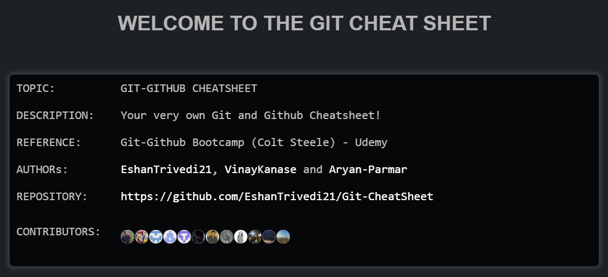

# Git-Github CheatSheet
## Your all in one Git, Github and Terminal Cheatsheet!

---

### You have various way to access and use the Cheatsheet:

+ ### 
+ ### 
+ ###  
+ ### 

---

---

### To Contribute read [CONTRIBUTING.md](CONTRIBUTING.md), Please leave a review!
### Thank You :

